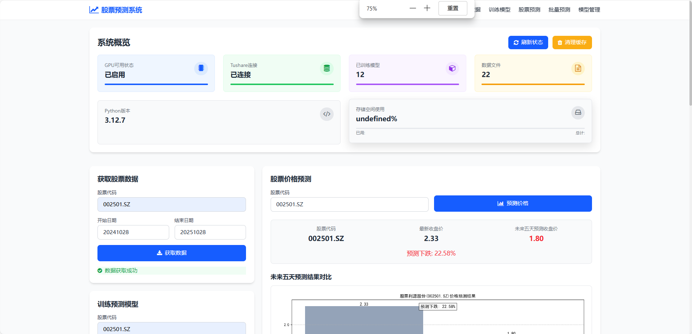
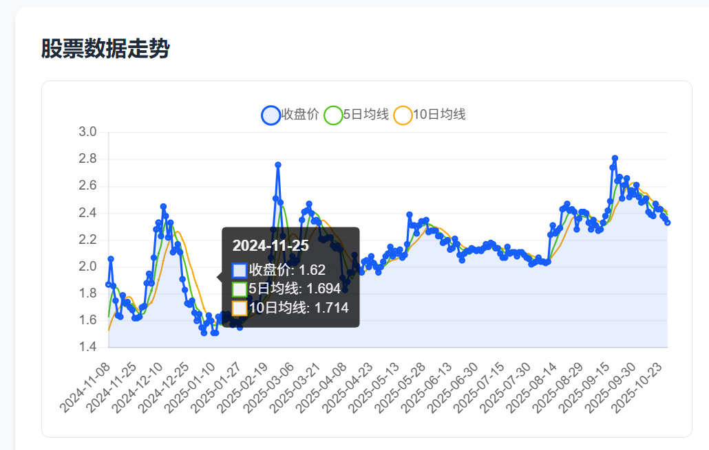

# 股票价格预测系统 🚀

<div align="center">


</div>

<br>

基于深度学习的股票价格预测系统，集成了Tushare金融数据平台，使用LSTM模型进行智能股票价格预测。




## 🌟 特性

- 🤖 **深度学习模型**：基于LSTM的股票价格预测
- 📊 **数据管理**：智能缓存系统，高效的数据获取和管理
- 📈 **专业可视化**：K线图、技术指标、预测趋势图
- 🎯 **智能选股**：多维度股票筛选和风险评估
- 💻 **双模式支持**：命令行和Web界面两种使用方式
- ⚡ **高性能**：缓存优化、批量处理支持

## 📦 快速开始

### 环境要求

- Python 3.8+
- 4GB+ RAM
- 500MB+ 可用磁盘空间

### 安装步骤

```bash
# 1. 克隆项目
git clone https://github.com/guts-yang/stock_predictor
cd stock_predictor

# 2. 安装依赖
pip install -r requirements.txt

# 3. 配置Tushare API Token
# 编辑 .env 设置 TUSHARE_TOKEN
```

### 一键启动

**Web界面**:
```bash
# Windows系统
start_server.bat

# Linux/Mac系统
chmod +x start_server.sh
./start_server.sh

# 或直接运行
python backend/api/app.py

# 访问 http://localhost:5000
```

**命令行界面**:
```bash
python cli/main.py
```

## 🎯 核心功能

### 1. 数据获取与管理
- 通过Tushare API获取实时和历史股票数据
- 智能缓存系统，避免重复请求
- 自动数据清理和优化

### 2. 模型训练与预测
- 基线LSTM模型：专注收盘价预测
- K线LSTM模型：多特征预测（开、高、低、收、量）
- 早停机制和学习率调度
- 自动保存最佳模型

### 3. 智能预测
- 单股预测：精准预测未来5天价格
- 批量预测：最多支持20只股票并行预测
- 预测结果可视化和导出

### 4. 专业可视化
- K线图表：专业级金融图表
- 技术指标：MA、MACD、RSI、布林带等
- 预测对比：历史数据与预测结果对比
- 图表导出：支持保存为图片

### 5. 智能选股
- 动量策略：基于价格动量筛选
- 价值策略：基于估值指标筛选
- 成长策略：基于成长性指标筛选
- 风险评估：多维度风险评价

## 📁 项目结构

```
stock_predictor/
├── backend/                      # 后端代码
│   ├── core/                    # 核心业务逻辑
│   │   ├── stock_data.py       # 数据获取与处理
│   │   ├── stock_model.py      # LSTM模型定义
│   │   ├── cache_manager.py    # 缓存管理
│   │   └── config.py           # 系统配置
│   ├── services/                # 服务层
│   │   ├── train_stock_model.py    # 模型训练
│   │   ├── predict_stock.py        # 股票预测
│   │   ├── financial_visualization.py  # 金融可视化
│   │   └── stock_selector.py        # 智能选股
│   └── api/                     # Flask API
│       └── app.py               # Web应用入口
├── frontend/                    # 前端资源
│   ├── templates/               # HTML模板
│   │   ├── index.html          # 主界面
│   │   └── stock_selector.html # 选股界面
│   └── static/                  # 静态资源
│       ├── css/
│       │   └── main.css
│       └── js/
│           ├── data-visualization.js
│           └── painting.js
├── cli/                         # 命令行工具
│   └── main.py                 # CLI入口
├── data/                        # 数据存储目录
├── models/                      # 模型文件目录
├── plots/                       # 图表存储目录
├── results/                     # 预测结果目录
├── logs/                        # 日志目录
├── figures/                     # 文档图片
├── README.md                    # 项目说明
├── requirements.txt             # 依赖列表
├── .gitignore                   # Git配置
├── .env.example                 # 环境变量示例
├── start_server.bat             # 启动脚本
└── start_server.sh              # Linux启动脚本
```

## 💻 使用指南

### 命令行方式

```bash
# 训练模型
python train_stock_model.py --code 000001.SZ --start_date 20200101 --end_date 20231231

# 预测股价
python predict_stock.py --code 000001.SZ --date 20240101

# 智能选股
python stock_selector.py --strategy momentum --risk_level medium
```

### Web界面方式

1. 启动服务器：`python app.py`
2. 访问：`http://localhost:5000`
3. 使用界面进行数据查询、模型训练和预测

## ⚙️ 配置说明

主要配置文件：`config.py`

| 配置参数 | 默认值 | 说明 |
|----------|--------|------|
| TUSHARE_TOKEN | - | Tushare API访问令牌 |
| DATA_DIR | "./data" | 数据文件存储路径 |
| MODEL_DIR | "./models" | 模型文件存储路径 |
| PREDICTION_HORIZON | 5 | 预测未来天数 |
| BATCH_SIZE | 32 | 批处理大小 |
| LEARNING_RATE | 0.00091 | 学习率 |
| EPOCHS | 100 | 训练轮数 |

## 🚀 部署指南

### 本地部署

```bash
# 启动应用
python app.py

# 访问应用
# http://localhost:5000
```

### 生产部署

```bash
# 使用Gunicorn
gunicorn -w 4 -b 0.0.0.0:5000 app:app

# 使用Docker
docker build -t stock-predictor .
docker run -p 5000:5000 stock-predictor
```

## 🗄️ 数据库配置（可选，v2.0.0新增）

本项目支持PostgreSQL数据库存储股票数据和模型，提供更好的数据管理和查询性能。

### 使用Docker启动PostgreSQL（推荐）

```bash
# 启动PostgreSQL容器
docker run -d \
  --name stock-predictor-db \
  -e POSTGRES_USER=postgres \
  -e POSTGRES_PASSWORD=your_password \
  -e POSTGRES_DB=stock_predictor \
  -p 5432:5432 \
  postgres:16-alpine

# 初始化数据库并迁移现有数据
python init_db.py
```

### 使用本地PostgreSQL

1. 安装PostgreSQL: https://www.postgresql.org/download/
2. 创建数据库:
   ```sql
   CREATE DATABASE stock_predictor;
   ```
3. 配置.env文件:
   ```env
   DB_HOST=localhost
   DB_PORT=5432
   DB_NAME=stock_predictor
   DB_USER=postgres
   DB_PASSWORD=your_password
   ```
4. 初始化数据库:
   ```bash
   python init_db.py
   ```

### 切换存储模式

在`backend/core/config.py`中设置:
```python
USE_DATABASE = True   # 使用PostgreSQL（需要先运行 init_db.py）
USE_DATABASE = False  # 使用本地文件（默认模式）
```

**注意**:
- 数据库模式为可选功能，默认使用文件存储
- 迁移前请确保PostgreSQL服务已启动
- 迁移过程会保留所有现有数据
- 可以随时在文件和数据库模式间切换

## 🔒 安全注意事项

⚠️ **重要提醒**：
- `config.py` 中包含 Tushare API Token
- 请勿将包含真实 token 的 `config.py` 提交到公开仓库
- 建议使用环境变量存储敏感信息：
  ```python
  import os
  TUSHARE_TOKEN = os.getenv('TUSHARE_TOKEN', 'your_token_here')
  ```

## 📚 常见问题（FAQ）

### Q: 如何获取Tushare API Token？
A: 访问 [Tushare官网](https://tushare.pro/) 注册账号，在个人中心获取API Token。

### Q: 数据文件存储在哪里？
A: 数据文件存储在 `data/` 目录，可以随时删除，系统会自动重新获取。

### Q: 模型文件可以删除吗？
A: 可以。模型文件存储在 `models/` 目录，删除后可以重新训练。

### Q: 预测准确率如何？
A: 预测准确率受多种因素影响，建议结合多种技术指标和分析方法使用。

### Q: 系统支持哪些股票？
A: 支持A股市场，包括沪深两市所有股票（股票代码格式：000001.SZ 或 600000.SH）

## 🛠️ 技术栈

- **深度学习**: PyTorch, LSTM
- **数据处理**: Pandas, NumPy, Scikit-learn
- **数据源**: Tushare API
- **可视化**: Matplotlib, mplfinance, Chart.js
- **Web框架**: Flask
- **前端**: Tailwind CSS, Axios

## 📊 系统状态

- ✅ **系统稳定**: 核心功能完整，运行稳定
- ⚡ **性能优化**: 缓存效率提升，批量处理支持
- 🔧 **健壮性**: 完整的错误处理和重试机制
- 📈 **功能完整**: 支持单股预测、批量预测、智能选股
- 🎯 **生产就绪**: 可直接部署使用

## 📝 更新日志

### v2.0.0 (2025-02-07)
- 🗄️ **重大更新**: 集成PostgreSQL数据库支持（可选功能）
- 📦 **数据迁移**: 提供init_db.py脚本，支持从CSV和模型文件迁移到数据库
- 🚀 **性能提升**: 利用数据库索引和连接池优化，提升查询性能
- 🔧 **架构优化**: 引入Repository模式，数据访问层解耦
- 🔄 **兼容性**: 保持向后兼容，支持文件/数据库双模式切换
- 📚 **文档更新**: 添加数据库配置和迁移指南
- ⚙️ **配置增强**: 完善环境变量配置，支持数据库连接参数

### v1.5.0 (2025-02-07)
- 🏗️ **重大架构重构**: 前后端分离，模块化设计
- 🐛 **修复图表显示**: 修复Plotly图表在Web界面不显示的问题
- 📦 **依赖更新**: 完善requirements.txt，添加Flask、Flask-CORS等缺失依赖
- 📚 **文档增强**: 添加版本徽章，提升专业度
- 🔧 **代码优化**: 改进项目结构，提升可维护性

### v1.4.0 (2024-12-04)
- ✨ 添加智能选股功能
- 🔧 优化项目结构，添加.gitignore
- 📚 更新文档，删除过时信息
- 🧹 清理临时文件和可重新生成的文件
- ⚡ 性能优化和稳定性提升

### v1.3.0 (2024-11-14)
- 🆕 添加智能选股系统
- 📈 增强金融可视化功能
- ⚡ 缓存性能提升30.97倍

### v1.2.0 (2024-10-15)
- 🎨 专业K线图表支持
- 📊 技术指标增强（MACD、RSI、布林带）
- 🔧 系统健壮性提升

### v1.0.0 (2024-09-01)
- 🎉 初始版本发布
- 基础预测功能
- Web界面和命令行支持

## ⚠️ 免责声明

本项目仅供学习和研究使用，股票预测结果仅供参考，不构成任何投资建议。投资有风险，入市需谨慎。

## 📄 许可证

MIT License

## 🤝 贡献

欢迎提交Issue和Pull Request！

## 📧 联系方式

如有问题或建议，欢迎通过Issue反馈。

---

**注意**: 本项目依赖Tushare API，使用前请确保已获取有效的API Token。
